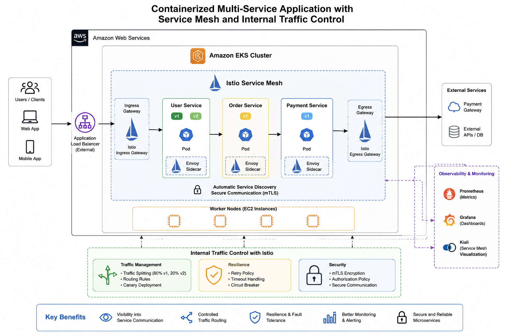
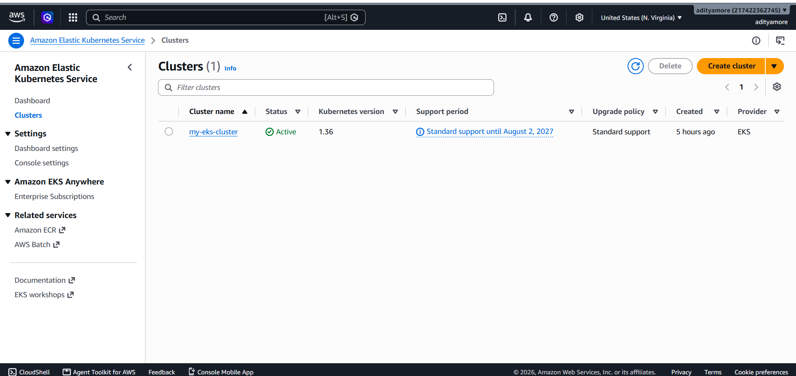
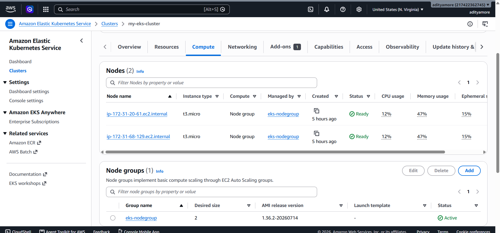
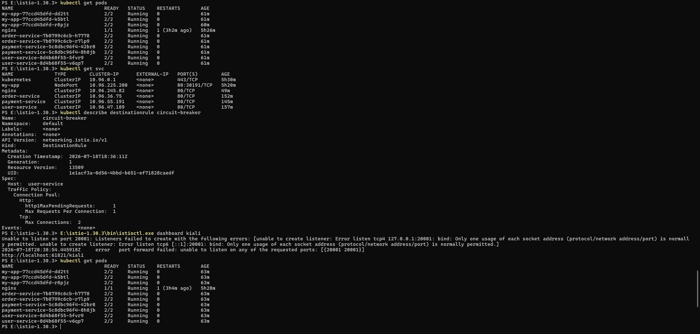
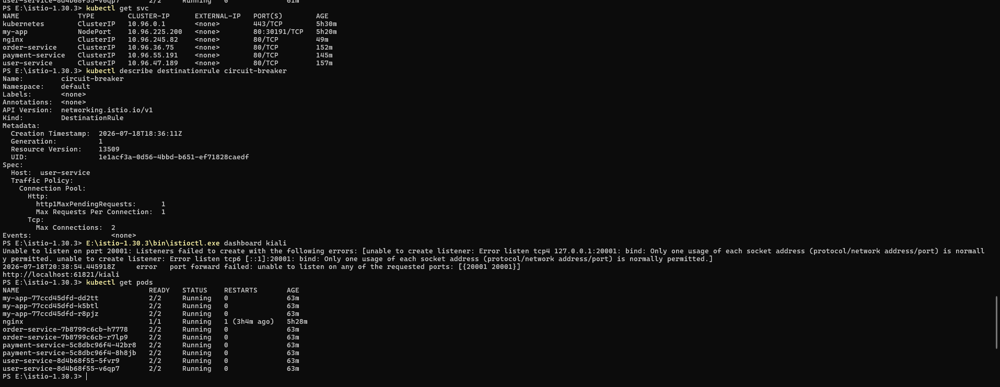
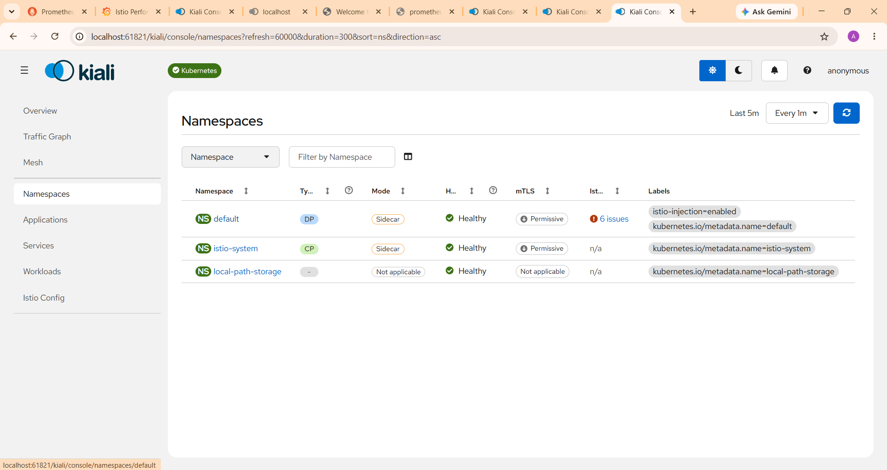
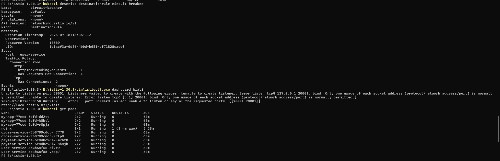
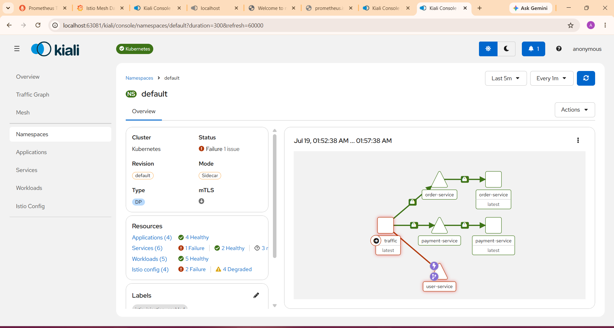
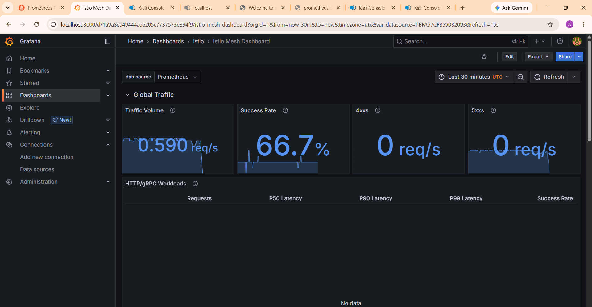
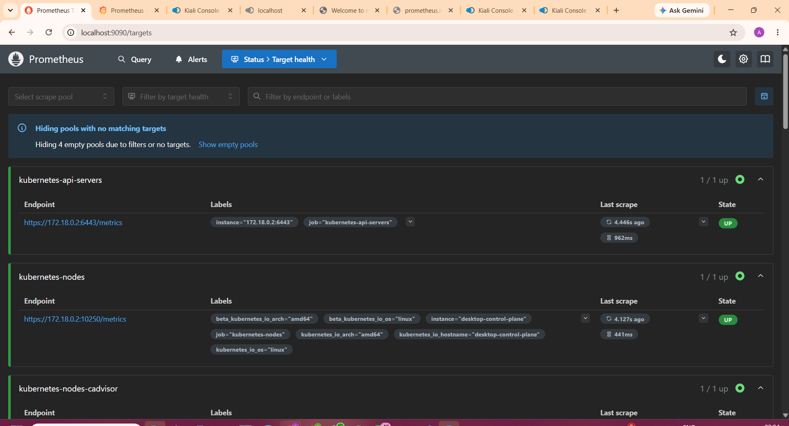

# Containerized Multi-Service Application with Istio Service Mesh on Amazon EKS


## Project Overview

This project demonstrates the deployment of a containerized multi-service application on Amazon EKS using Kubernetes and Istio Service Mesh. It implements traffic management, observability, and fault tolerance to improve communication between microservices.

## Project Scenario

A product company is migrating from a monolithic application to microservices. The development team faces the following challenges:

- No visibility into service-to-service communication
- No traffic routing mechanism
- No retry policy
- No circuit breaker for failure handling

This project addresses these challenges using Kubernetes and Istio.

---

## Objectives

- Deploy microservices on Amazon EKS
- Enable Istio Service Mesh
- Implement traffic management
- Configure retry policy
- Configure circuit breaker
- Monitor application using Prometheus, Grafana, and Kiali

---

## Technologies Used

- Amazon Web Services (AWS)
- Amazon EKS
- Kubernetes
- Docker
- Istio
- kubectl
- Prometheus
- Grafana
- Kiali
- Git & GitHub

---

  
## Project Architecture



### Architecture Overview

```text
                AWS (Default VPC)
                      |
                Amazon EKS Cluster
                      |
      ---------------------------------
      |               |               |
 User Service   Order Service   Payment Service
      |               |               |
      ----------- Istio Service Mesh ----------
                      |
     -----------------------------------------
     |                  |                    |
 Prometheus         Grafana              Kiali
```

---

## Project Structure

```
Microservice-EKS-Project/
│
├── user-service/
├── order-service/
├── payment-service/
├── k8s/
│   ├── user-deployment.yaml
│   ├── order-deployment.yaml
│   ├── payment-deployment.yaml
│   ├── services.yaml
│   ├── virtualservice.yaml
│   └── destination-rule.yaml
│
├── screenshots/
└── README.md
```

---
## Amazon ECR

Docker images for all microservices were built locally and pushed to Amazon Elastic Container Registry (ECR).

Repositories:
- user-service
- order-service
- payment-service

  
## 🚀 ✅*1. Prerequisites*

## Prerequisites

Ensure you have the following installed:

- AWS CLI configured (`aws configure`)
- kubectl installed
- eksctl installed
- Docker installed
- Helm installed

AWS IAM permissions required:
- EKS Cluster creation
- EC2
- IAM Role management
- VPC access

## 🚀 ✅*2. Add Step-by-Step Setup*

## Step 1: Create EKS Cluster

```bash
eksctl create cluster \
--name microservices-cluster \
--region us-east-1 \
--nodegroup-name standard-workers \
--node-type t3.medium \
--nodes 2
```
## Step 2: Configure kubectl
```bash
aws eks --region us-east-1 update-kubeconfig --name microservices-cluster
```
## Step 3: Verify Cluster
```bash
kubectl get nodes
```

---

# 🚀 ✅ 3. Build and Push Docker Images

```md
## Build and Push Docker Images

```bash
docker build -t user-service ./user-service
docker build -t order-service ./order-service
docker build -t payment-service ./payment-service
```

## Tag & push to ECR:
```bash
aws ecr create-repository --repository-name user-service

docker tag user-service:latest <ECR-URL>
docker push <ECR-URL>
```

---

# 🚀 ✅ 4. Add **Deploy to Kubernetes**

## Deploy to Kubernetes

```bash
kubectl apply -f k8s/
```

*Verify:*
```bash
kubectl get pods
kubectl get svc
```

---

# 🚀 ✅ 5. Install Istio

```md
## Install Istio

Download Istio:

```bash
curl -L https://istio.io/downloadIstio | sh -
cd istio-*
export PATH=$PWD/bin:$PATH
```
*Install Istio:*
```bash
istioctl install --set profile=demo -y
```
*Enable sidecar injection:*
```bash
kubectl label namespace default istio-injection=enabled
```

---

# 🚀 ✅ 6. Add **Apply Istio Config**

```md
## Apply Istio Configuration

```bash
kubectl apply -f k8s/virtualservice.yaml
kubectl apply -f k8s/destination-rule.yaml
```

---

# 🚀 ✅ 7. Add **Access Application**
```md
## Access Application

Get LoadBalancer URL:

```bash
kubectl get svc istio-ingressgateway -n istio-system
```

---

# 🚀 ✅ 8. Add **Monitoring Setup (Prometheus, Grafana, Kiali)**

```md
## Install Observability Tools

```bash
kubectl apply -f samples/addons/prometheus.yaml
kubectl apply -f samples/addons/grafana.yaml
kubectl apply -f samples/addons/kiali.yaml
```
```bash
kubectl apply -f samples/addons/prometheus.yaml
kubectl apply -f samples/addons/grafana.yaml
kubectl apply -f samples/addons/kiali.yaml
```

---

# 🚀 ✅ 9. Add **Port Forward Commands**

```md
## Access Dashboards
```
## *Kiali*
```bash
kubectl port-forward svc/kiali -n istio-system 20001:20001
```
## *Grafana*
```bash
kubectl port-forward svc/grafana -n istio-system 3000:3000
```
## *Prometheus*
```bash
kubectl port-forward svc/prometheus -n istio-system 9090:9090
```


---

# 🚀 ✅ 10. Add **Cleanup (VERY IMPORTANT)**

```md
## Cleanup

```bash
eksctl delete cluster --name microservices-cluster --region us-east-1
```

---


## Kubernetes Deployment

- Created Deployments
- Created Services
- Verified Pods
- Verified Services

---

## Istio Service Mesh

Implemented:

- Sidecar Injection
- Virtual Service
- Destination Rule
- Traffic Routing
- Retry Policy
- Circuit Breaker

---

## Traffic Management

### Traffic Splitting

- Version v1 → 80%
- Version v2 → 20%

### Retry Policy

- Retry Attempts: 3

### Circuit Breaker

Configured using Istio DestinationRule with connection pool and outlier detection.

---

## Observability

### Prometheus

- Request Metrics
- Service Metrics

### Grafana

- Request Latency
- Error Rate
- Traffic Monitoring

### Kiali

- Service Graph
- Service Health
- Traffic Flow Visualization

---

# Verification Commands

```bash
kubectl get pods
kubectl get svc
kubectl get virtualservice
kubectl get destinationrule
kubectl get all
```

---

# Screenshots

## 1. Amazon EKS Cluster



---

## 2. EKS Node Group



---

---

## 3. Running Pods



---

## 4. Kubernetes Services



---

## 5. Istio VirtualService



---

## 6. Istio DestinationRule



---

## 7. Kiali Dashboard



---

## 8. Grafana Dashboard



---

## 9. Prometheus Dashboard



---

## Business Impact

- Improved fault tolerance using circuit breaker
- Reduced downtime with retry policy
- Increased observability across services
- Enabled controlled traffic routing

  
# Results

- Successfully deployed containerized microservices on Amazon EKS.
- Implemented Istio Service Mesh.
- Configured traffic routing using VirtualService.
- Configured Retry Policy.
- Implemented Circuit Breaker.
- Monitored services using Prometheus, Grafana, and Kiali.
- Achieved improved observability and internal traffic control.

---

# Future Enhancements

- Canary Deployment
- Blue-Green Deployment
- Distributed Tracing with Jaeger
- mTLS between services
- CI/CD Integration using Jenkins and GitHub Actions

---

# Author

**Aditya More**

AWS & DevOps Engineer
